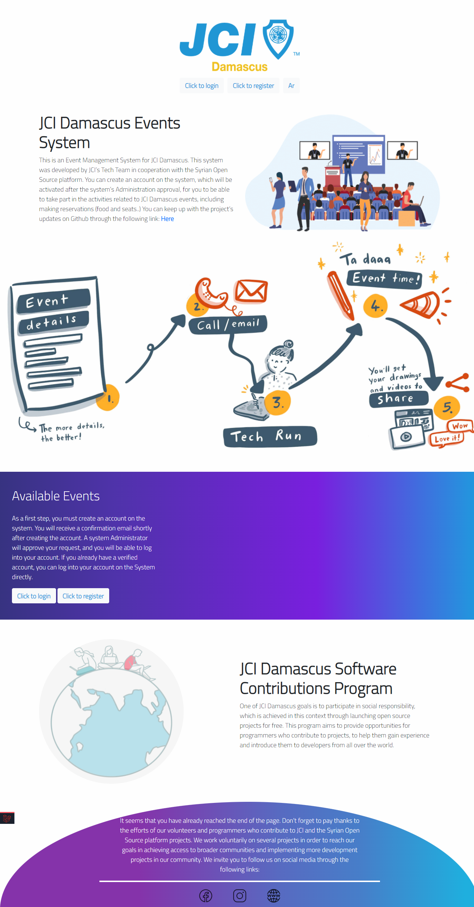
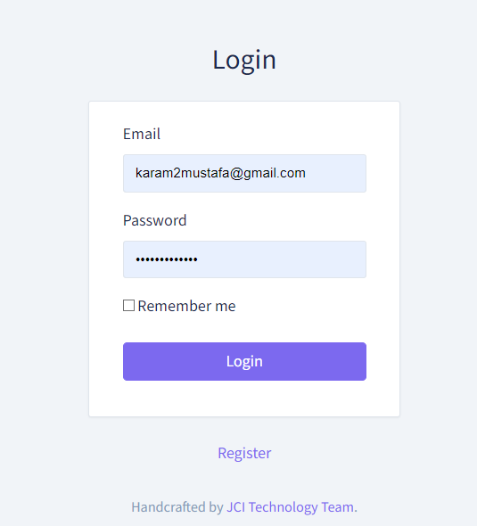
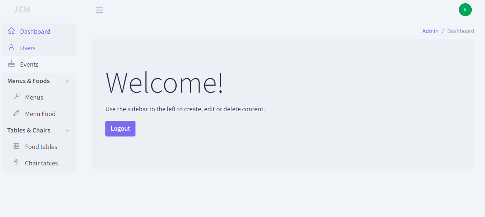
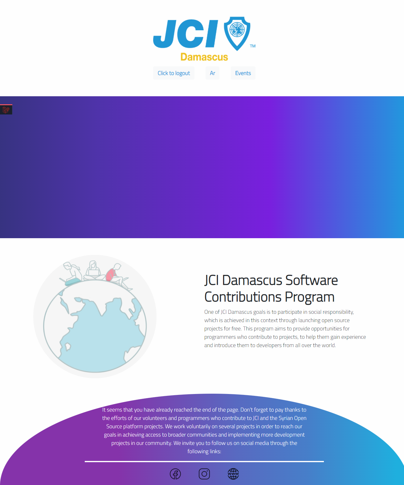
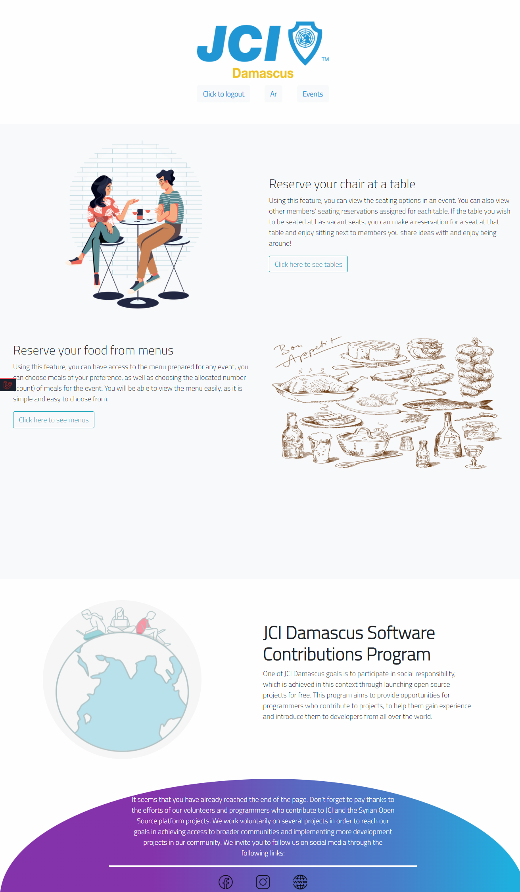
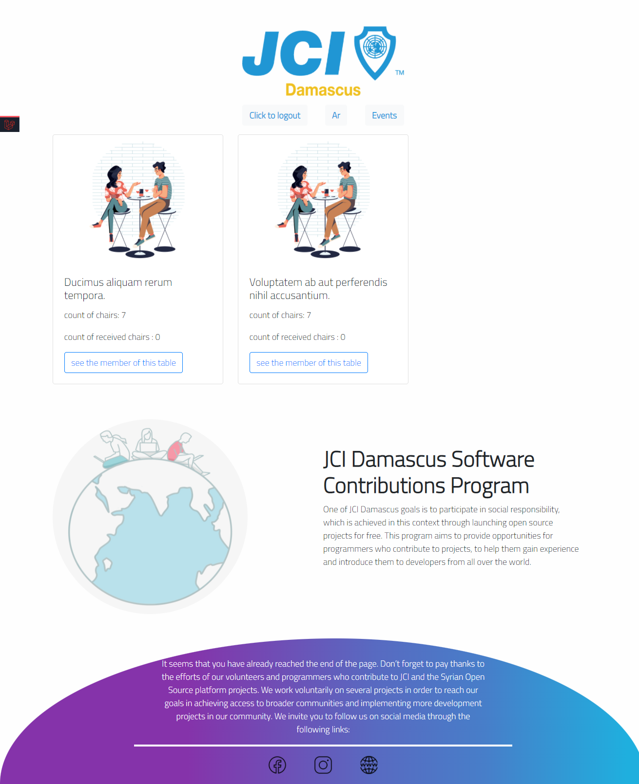
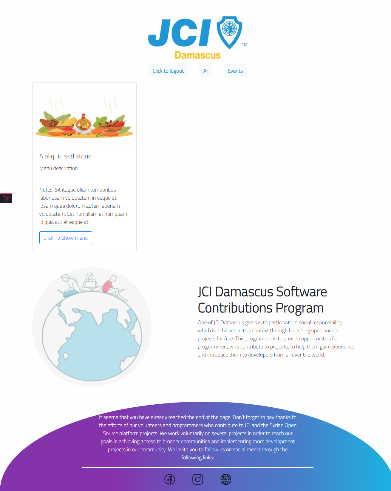

    <h1> JCI Damascus Events System </h1>
    

## What is JCI?
Junior Chamber International, commonly referred to as JCI, is a non-profit international non-governmental organization
of young people between 18 and 40 years old. It has members in about 124 countries, and regional or national organizations in most of them
The first local Junior Chamber chapter was founded in 1915, but the international umbrella organization Junior Chamber International (JCI) was founded in Mexico in 1944. It has consultative status with the Council of Europe, with the Economic and Social Council of the United Nations and with UNESCO
It encourages young people to become active citizens and to participate in efforts towards social and economic development, and international cooperation, good-will and understanding

## What is JCI Damascus?
It is also part of a large organization, consisting of 225 - 250 members each year, and is located in Syria Damascus.
It implements many development projects at the professional and societal level, and also has many technical projects
The technical team in the organization decided to join the open source projects in order to contribute to the community and also to share with the community the way in which they manage the technical projects within the organization

## What is this project?
The organization organizes several events every quarter of the year,
and these events must be registered by members within the organization in a certain way,
so that chairs are reserved at the tables and also choose meals from the menus,
so the technical team within the organization developed this project to organize 
the registration process and manage members Registered people,
as well as issuing reports in order to organize the event more effectively

## How to understand the requirements?
We have written the required system specifications (SRS) in a professional way. Find the file from [here](config/JCI%20Events%20Projects%20SRS%20v1.3.pdf)
You may find that the SRS file version differs from the project release,
we explain all the changes when we make a new release of this project.

## technical requirements
- php version [^7.4]
- laravel version [^8.4]
- composer version [^2]

## installation
- clone this repo
> - git clone git@github.com:syrian-open-source/jci-damascus-events.git
>
- Run commands (this should run all dependencies)
> - cd ./jci-damascus-events
>
> - composer install
>
> - php artisan jci:install

* Note: this project use the laravel backpack for the admin side, and laravel-shift/blueprint to draw the migrations

you can now navigate to http://127.0.0.1:8000 and see the main page, this what the main page looks like

# Usage
All the use case were described in the srs file, but for the programming part we sill summarize the usage and how to deal with this project, it contains two sides:
* admin side, we built this side using backpack admin panel
* client side, we built this side using bootstrap and blade engine

## Admin side
By this panel You can add an event and add tables and menus for it, and manage the users.

- Go to http://localhost:8000/admin/login to login to admin panel (<b>notes<b/> that if you want to register a new admin account, you must enable this feature by remove this route part [here](https://github.com/karam-mustafa/jci-damascus-events/blob/main/routes/backpack/custom.php#L11)) but we have already put a default admin from seeder you run jci:install command 

- You can see the main page of admin panel

- from this panel you can add:
  - Add, update, approve users
  - Event with details, do not forget to active this event (see this [picture](./public/images/docs/pic4.png)), and you can see the registered users with they food and tables selection from two buttons:
    -  Show Registrations Statistics: navigate to another page that make you able to see each table and the registered users on it 
    -  Export Registrations Statistics: export excel file that contains each table and its users with food selection
  - food tables for the created event, each tables must has a char count and the system will create set of chairs that related with this table 
  - menu for this event and you can add also items into this menu

## Client side
- first step is register a new client account from this link http://localhost:8000/register
- you must receive verification link to verify your account (we use breeze package for authentication process), and do not forget to update mail info from .env file
- after verifying your email, you must be able to see the active events, see the below picture

- After you click on see details link, you must be navigated to another page and see how you can register on tables and food

- first section makes you able to see the exists tables and choose any table to receive a chai on this table

- second section is for seeing the menu and choose the food from it.

<b font=red>Remember<b/> we described all the features in [SRS](config/JCI%20Events%20Projects%20SRS%20v1.3.pdf)) file

----------------

# ToDo list: 
We add all our requirements as issues above.

# About Syrian Open Source
The Syrian Open Source platform is the first platform on GitHub dedicated to bringing Syrian developers from different cultures and experiences together,
to work on projects in different languages, tasks, and versions, and works to attract Syrian developers to contribute more under one platform to open source software,
work on it, and issue it with high quality and advanced engineering features, which It stimulates the dissemination of the open-source concept in the Syrian software community,
and also contributes to raising the efficiency of developers by working on distributed systems and teams.
